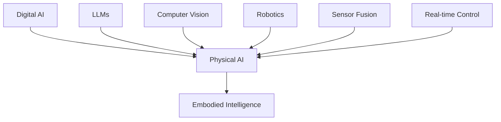

# Introduction to Physical AI & Humanoid Robotics

Welcome to the fascinating world of Physical AI and Humanoid Robotics! This textbook is designed to bridge the gap between digital artificial intelligence and embodied systems, providing you with the knowledge and practical skills needed to develop the next generation of intelligent robots.

## What is Physical AI?

Physical AI represents a paradigm shift in artificial intelligence research and development. While traditional AI focuses on processing data and making decisions in digital environments, Physical AI emphasizes the integration of AI capabilities with physical systems that can perceive, interact with, and manipulate the real world.

### Key Characteristics of Physical AI

- **Embodiment**: AI systems with physical form and sensors that interact with the environment
- **Real-time Processing**: Decision-making under temporal constraints
- **Uncertainty Management**: Operating in environments with incomplete information
- **Multi-modal Integration**: Combining vision, language, touch, and other sensory inputs
- **Action-Oriented**: AI that takes physical actions rather than just producing outputs

## The Rise of Humanoid Robotics

Humanoid robots represent one of the most challenging and promising areas in robotics. These robots, designed to resemble and interact with humans, require sophisticated integration of multiple AI and robotics technologies.

### Why Humanoid Robots Matter

1. **Human-Centric Design**: Humanoid robots can operate in environments designed for humans
2. **Social Interaction**: Human-like form facilitates natural interaction with people
3. **Versatility**: Human-like dexterity enables diverse manipulation tasks
4. **Research Platform**: Humanoid robots push the boundaries of robotics research

### Current Applications and Future Potential

- **Assistive Technologies**: Helping elderly and disabled individuals
- **Industrial Automation**: Flexible manufacturing and assembly
- **Healthcare**: Surgical assistance and patient care
- **Education**: Interactive learning companions
- **Entertainment**: Interactive characters and performers

## Course Overview

This textbook is structured into four comprehensive modules, each building upon the previous to provide a complete understanding of Physical AI and humanoid robotics.

### Module 1: ROS 2 Fundamentals (Weeks 1-5)
- Introduction to Robot Operating System 2
- Nodes, topics, services, and parameters
- Launch files and system configuration
- Basic robot control and simulation

### Module 2: Simulation Environments (Weeks 6-9)
- Gazebo simulation fundamentals
- NVIDIA Isaac Sim for advanced humanoid simulation
- URDF and Xacro for robot modeling
- Sensor integration and perception

### Module 3: Perception and Control (Weeks 10-13)
- Computer vision for robotics
- Localization and mapping
- Control theory and implementation
- Navigation systems

### Module 4: Vision-Language-Action Integration (Weeks 14-17)
- Multimodal AI models
- Natural language interaction
- Vision-language-action pipelines
- Advanced humanoid behaviors

### Capstone Project (Weeks 18-20)
- Integration of all learned concepts
- Development of a complete humanoid robot application
- Voice command processing and execution
- Final project demonstration

## Learning Outcomes

By the end of this course, you will be able to:

- Design and implement ROS 2 nodes for complex robotic applications
- Simulate and test humanoid robot behaviors in realistic environments
- Integrate multiple sensory inputs for robust robot perception
- Implement control systems for stable humanoid locomotion
- Create vision-language-action pipelines for natural robot interaction
- Deploy AI models for real-time robotic decision making
- Understand and address the challenges of embodied AI systems

## Prerequisites and Assumed Knowledge

This textbook is designed for intermediate-to-advanced students and professionals with a background in AI and Python programming. Before starting, you should have:

- **Python Programming**: Proficiency in Python 3.x, including object-oriented programming concepts
- **AI/ML Fundamentals**: Understanding of basic machine learning concepts and neural networks
- **Mathematics**: Basic knowledge of linear algebra, calculus, and probability
- **Linux Command Line**: Comfortable with terminal operations and package management
- **Git Version Control**: Familiarity with Git for code management

While prior robotics experience is helpful, it is not required. We will introduce all necessary robotics concepts throughout the course.

## Technology Stack

This textbook uses the latest technologies in robotics and AI:

- **ROS 2 Jazzy**: The latest long-term support release of the Robot Operating System
- **NVIDIA Isaac Sim**: Advanced simulation environment for humanoid robots
- **Gazebo Harmonic**: Open-source simulation environment
- **Python/rclpy**: Primary development language and ROS 2 client library
- **Modern VLA Models**: Vision-Language-Action models including RT-2, OpenVLA, and Gemini Robotics

## Hands-On Learning Approach

This textbook emphasizes practical, hands-on learning. Each concept is accompanied by:

- **Runnable Code Examples**: All code examples are tested and verified to run in specified environments
- **Simulation Exercises**: Practical exercises that can be completed in simulation
- **Hardware Extensions**: Optional extensions for those with access to physical hardware
- **Progressive Complexity**: Building from simple concepts to complex integrated systems

## The Embodied Intelligence Focus

Throughout this textbook, we maintain a strong focus on embodied intelligence—the idea that intelligence emerges from the interaction between an agent and its environment. This perspective shapes our approach to:

- **Perception**: Understanding how robots interpret sensory information
- **Action**: How robots make decisions and execute physical actions
- **Learning**: How robots improve through interaction with the environment
- **Adaptation**: How robots adjust to changing conditions and tasks

## Safety and Ethics Considerations

As we develop increasingly capable robots, it's crucial to consider safety and ethical implications. Throughout the textbook, we'll address:

- **Safety Protocols**: Best practices for safe robot operation
- **Privacy Concerns**: Handling of data collected by robots
- **Social Impact**: The effects of humanoid robots on society
- **Responsible Development**: Ethical considerations in AI and robotics development

## Getting Started

To begin your journey in Physical AI and Humanoid Robotics:

1. Complete the setup guide in the next section
2. Ensure you have the required prerequisites
3. Set up your development environment
4. Run your first ROS 2 example
5. Progress through the modules sequentially

The path ahead is challenging but rewarding. You'll be joining a field that's at the forefront of technological innovation, working on systems that will shape the future of human-robot interaction.

## Next Steps

In the next section, we'll guide you through setting up your development environment and running your first Physical AI example. We'll cover:

- Installing ROS 2 Jazzy
- Setting up simulation environments
- Creating your first ROS 2 package
- Running basic robot simulation

Let's begin this exciting journey into the world of Physical AI and Humanoid Robotics!